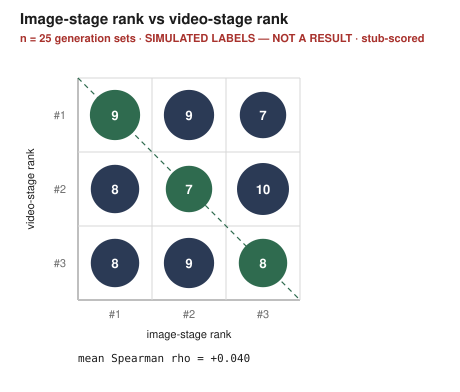
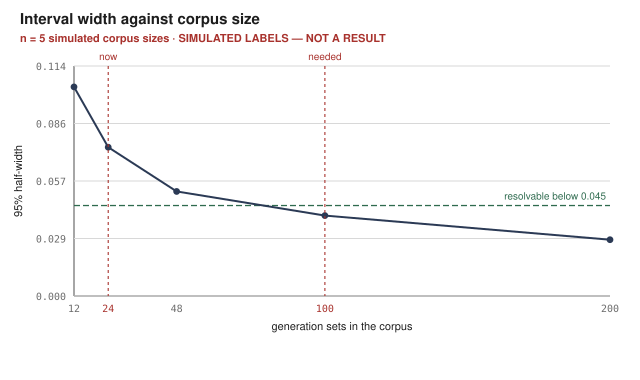

# Results: multi-candidate ad generation with learned ranking

*Generated 2026-08-12 10:04 UTC by `scripts/report.py (at 55bd565)`. Do not edit — regenerate.*

> **This document is not a result yet.** At least one table below rests on
> simulated labels or stand-in features. Each such table says so above its
> own header, and the outstanding list below names what has to happen for
> the numbers to mean something.

## Outstanding before these numbers stand

- **image-stage prediction vs video-stage human preference** — no video-stage pairwise judgements exist. The video corpus is empty and no annotator has ranked a generated clip, so the image->video claim cannot be measured against human preference at all
- **pairwise (trained), BT-target ridge, salience-only, aesthetic-only, LLM-as-judge, random; every feature group** — no human pairwise judgements exist. The annotation tool is built and verified against a simulated session, and no annotator has used it, so there is nothing to train or evaluate on. This is the project's critical path: collect judgements at /annotate/ui
- **embedding, aesthetic, identity groups** — additionally needs notebooks/colab_embeddings.ipynb run on a GPU; no GPU has executed it, so these rows are pending rather than zero
- **Premium-tier jobs** — the two fal contract smoke tests ($0.39) have not been run and no key has been supplied, so no paid generation exists and the golden set is frozen from synthetic references
- **Research-tier clips** — notebooks/colab_video.ipynb has not been run on a GPU, so the free clip corpus is empty and the tier comparison has no data

## The headline claim: does the image-stage ranking predict the video-stage one?

The project's claim is that ranking three candidates as *images* anticipates how they rank once animated, which is what makes early prediction worth anything: the video stage is where the money goes. The claim has two halves and only one of them is computable today.

Rank movement between the stages, over 9 candidate placements: -1 → 3, +0 → 4, +1 → 1, +2 → 1.

**Image-stage to video-stage rank agreement**

> ⚠️ **n = 3 generation sets · scored by stub heuristic · labels are simulated — NOT A RESULT · 5 replayed record(s) collapsed by content**

| Comparison | Mean Spearman ρ [95% CI] | Mean Kendall τ | Top-1 retention [95% CI] | Sets |
| :--- | ---: | ---: | ---: | ---: |
| image-stage prediction vs video-stage prediction (diagnostic) | +0.333 [-0.500, +1.000] | +0.333 | 0.333 [0.000, 1.000] | 3 |
| **image-stage prediction vs video-stage human preference** | *pending — no video-stage pairwise judgements exist. The video corpus is empty and no annotator has ranked a generated clip, so the image->video claim cannot be measured against human preference at all* |  |  |  |

## The predictor against its baselines

Every accuracy is pooled over set-wise cross-validation folds, compared against the baselines with a paired test on the same held-out comparisons, and read against the annotator noise ceiling rather than against 1.0. The reasoning for all three is in `docs/prediction-protocol.md`.

The rows above are named rather than omitted. A reader who cannot see that LLM-as-judge is one of the planned baselines cannot tell whether it was tried and lost or never run.

**Held-out pairwise accuracy against baselines**

> ⚠️ **n = 0 comparisons · labels are simulated — NOT A RESULT**

| Model | Accuracy [95% CI] | % of ceiling | n | Δ vs trained [95% CI] |
| :--- | ---: | ---: | ---: | ---: |
| **pairwise (trained), BT-target ridge, salience-only, aesthetic-only, LLM-as-judge, random** | *pending — no human pairwise judgements exist. The annotation tool is built and verified against a simulated session, and no annotator has used it, so there is nothing to train or evaluate on. This is the project's critical path: collect judgements at /annotate/ui* |  |  |  |

**Feature-group ablation, each row paired against the full model**

> ⚠️ **n = 0 comparisons · labels are simulated — NOT A RESULT**

| Variant | Columns | Accuracy [95% CI] | Δ vs full [95% CI] | Verdict |
| :--- | ---: | ---: | ---: | :--- |
| **every feature group** | *pending — no human pairwise judgements exist. The annotation tool is built and verified against a simulated session, and no annotator has used it, so there is nothing to train or evaluate on. This is the project's critical path: collect judgements at /annotate/ui* |  |  |  |
| **embedding, aesthetic, identity groups** | *pending — additionally needs notebooks/colab_embeddings.ipynb run on a GPU; no GPU has executed it, so these rows are pending rather than zero* |  |  |  |

## Why the corpus has to grow

The interval on a pairwise accuracy is set by how many held-out comparisons survive an honest set-wise split, and at the current corpus size it is wider than every difference between models — so nothing about the predictor is resolvable yet. This is the measurement behind treating the generation run as necessary rather than optional.

**Pooled 95% half-width against corpus size**

> ⚠️ **n = 5 simulated corpus sizes · labels are simulated — NOT A RESULT · simulation from docs/prediction-protocol.md §6, not an observation; the corpus holds 24 set(s) today**

| Generation sets | 95% half-width | Resolvable? |
| ---: | ---: | :--- |
| 12 | 0.104 | no |
| 24 | 0.074 | no |
| 48 | 0.052 | no |
| 100 | 0.040 | yes |
| 200 | 0.028 | yes |

## The working product

The pipeline runs end to end: intake and product cutout, a sampled design space expanded into shot briefs, three image candidates, a hard quality gate, the image-stage ranking, three 8–10 s videos, the video-stage ranking with explanations, and delivery — saliency-aware reframes per platform, mockup previews, an ffmpeg audio mix gated on a recorded licence, report cards and a download bundle.

**What has actually run**

> ⚠️ **n = 8 completed job records · 3 generation sets · labels are simulated — NOT A RESULT · mock and replay tiers only; no premium generation has been paid for**

| Item | Value | Note |
| :--- | ---: | :--- |
| Job records on disk | 10 | all tiers |
| Completed jobs | 8 | reached delivery |
| Distinct generation sets | 3 | 5 replay(s) collapsed by candidate content |
| Total spend | $0.0000 | no API call has been made; mock mode is the default |
| **Premium-tier jobs** | *pending — the two fal contract smoke tests ($0.39) have not been run and no key has been supplied, so no paid generation exists and the golden set is frozen from synthetic references* |  |
| **Research-tier clips** | *pending — notebooks/colab_video.ipynb has not been run on a GPU, so the free clip corpus is empty and the tier comparison has no data* |  |
